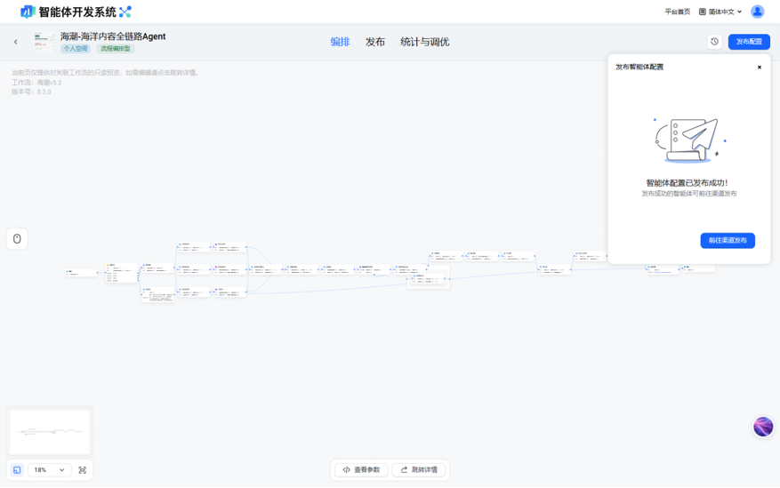

# 海潮｜福州海洋产业可信内容智能体

> 🌊 **在线体验**：<https://haichao-web-demo.pages.dev/>
> 参赛：闽都×火山杯 Agent 创新大赛

面向海洋产业内容生产场景的可信内容智能体：**生成 → 证据核验 → 风险提示**闭环——不只产出内容，还对每一条关键陈述给出证据来源与可信度提示，让产业内容"写得快"也"靠得住"。

## 项目构成（哪些是我开发的）

| 部分 | 内容 | 位置 |
|---|---|---|
| **智能体编排设计** | 3 个专业 Agent、24 个工作流节点、11 层可信链路的流程与提示词设计 | 火山引擎 HiAgent 平台（云端搭建，APPID `d9m72hpb9rsa732fojg0`） |
| **Web 体验前端** | 沉浸式单页体验站，视觉语言围绕「福州向海、证据可信、产业落地」原创设计 | `public/` |
| **API 安全接入层** | 密钥只放服务端，前端统一走本站代理转发，支持 Cloudflare Workers / Node 双形态 | `functions/`、`server/` |

智能体本体搭建在 HiAgent 平台（无本地源码形态），其设计资产——Agent 拆分、工作流节点编排、可信链路——是本作品的核心；本仓库承载的是为同作品独立开发的体验端与安全接入层。

## 智能体一览

- 智能体名称：海潮-海洋内容全链路Agent
- 运行版本：`v5.2.0`（体验页状态接口实时回读，非静态写死）
- API 地址：`http://14.103.118.162:32300/api/proxy/api/v1`
- 能力表达：3 个专业 Agent、24 个工作流节点、11 层可信链路

HiAgent 平台工作流编排画布（海潮v5.2，v5.2.0 发布成功）：

## 本地运行

1. 复制配置：把 `.env.example` 复制为 `.env`
2. 如果暂时不接真实 API，可以不填 `HIAGENT_API_KEY`，页面会自动进入演示模式
3. 如需接真实 API，把 HiAgent 发布页的 API 密钥填入 `.env` 的 `HIAGENT_API_KEY`
4. 启动：`npm start`，打开 `http://localhost:4173`

## 安全原则

- API 密钥只放服务端 `.env`，不写进 `public/` 任何前端文件；前端只请求本站的 `/api/haichao`
- 展示时可以露出 API 地址、APPID、版本和运行状态，不展示 API 密钥
